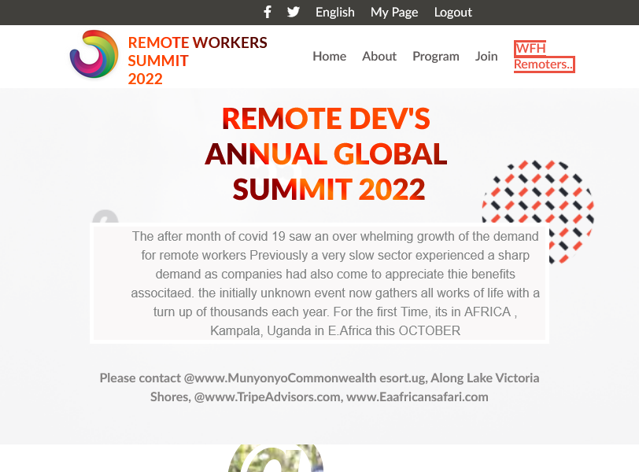

# Remote Devs Global summit Confrence

> A capstone Project template for an a Global Conference

## Built With

- HTML
- CSS
- Javascript
- Git & Github

## Live Demo

[Live Demo]( https://canon20paul.github.io/Capstone-Proj1/)

## Video Demo

[Video Demo](https://www.loom.com/share/266bc24ed49742a483c0afc2a581f5a8)

## Snapshots

## Authors

👤 **Paul Malongo**

- GitHub: [@canon20paul](https://github.com/canon20paul)
- Twitter: [@paulmalongo](https://twitter.com/paulmalongo)
- LinkedIn: [Paulmalongo](https://linkedin.com/in/paulmalongo)

## 🤝 Contributing

Contributions, issues, and feature requests are welcome!

Feel free to check or comment them on the [issues page](https://github.com/canon20paul/Capstone-Project-1-Confrence).

## Show your support

Give a ⭐️ if you like this project!

## Acknowledgments

- Cindy Shinon Behance for her UI design template
- nft.nyc for using their speaker images

## 📝 License

This project is [ Creative Commons license](https://creativecommons.org/licenses/by-nc/4.0/) licensed.
